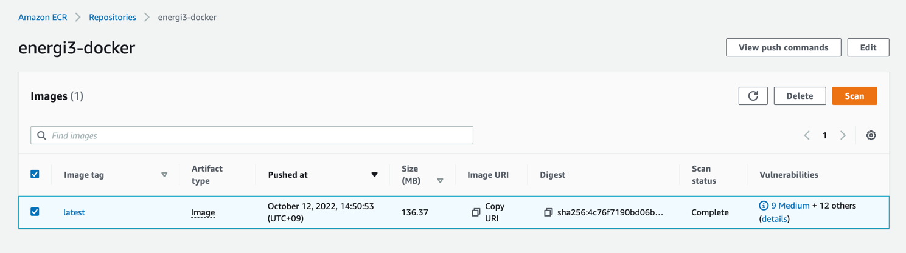
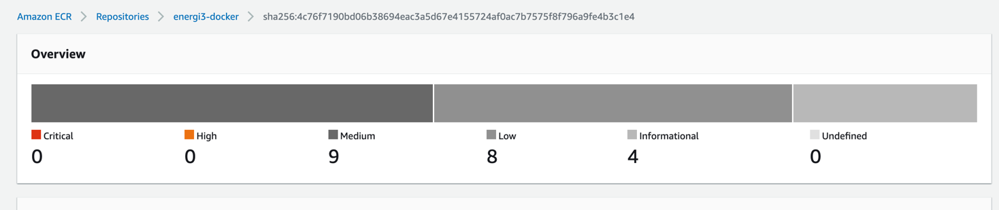

# Question 1

## How to run it
```
# Build image
docker build -t energi3 .
# Run Docker container
docker run --name energi3-client-node -it energi3
```

### Dockerfile
I'm using this [script](https://github.com/energicryptocurrency/energi3-provisioning/blob/master/scripts/linux/energi-linux-installer.sh) and adding some simple logic codes for supporting docker  
1. Add new arguments for script to install energy3 core node in docker:
```
arguments (optional):
    -c  --container           : Setup docker container
    -t  --testnet             : Setup testnet
    -r  --rsa                 : Setup token based login
    -f  --2fa                 : Setup 2-Factor Authentication
    -rf --rm2fa               : Remove 2-Factor Authentication
    -h  --help                : Display this help text
    -d  --debug               : Debug mode

    
case $key in
-c|--container|-container)
    isDocker="y"
    _os_arch
    _check_install
    _install_apt
    _set_ismainnet
    _check_clock
    _add_swap
    _add_logrotate
    _install_energi
    _add_systemd
    _start_energi
    exit 0
    ;;    
```
Result:

I coppied my keystore manually to: /home/nrgstaker/.energicore3/keystore and verify it. 
The result looks good:

```
> personal.listAccounts
["0x2f7611e22b5e5c8e703a36eeafa7d5fa4eb646c2"]

> miner.stakingStatus()
{
  accounts: [],
  hash: "0x0c0dccfc670b74ad4fea36effe451e54fbc25009c55be332054e2f712adf9ec9",
  height: 12297,
  miner: false,
  nonceCap: 0,
  staking: false,
  totalWeight: 0
}

> nrg.syncing
{
currentBlock: 6330,
highestBlock: 1360132,
knownStates: 0,
pulledStates: 0,
startingBlock: 0
}
```


2. Added checksum step for function _install_energi
```
# Checksum energi3 downloaded package
wget -4qo- "${S3URL}/${GIT_VERSION_TAG}/SHA256SUMS" --show-progress --progress=bar:force:noscroll 2>&1
sleep ${WAIT_EXEC}
sha256sum -c --ignore-missing SHA256SUMS
if [ "$?" -ne 0 ]
then
    echo "Checksum failed please check your downloaded files"
    exit 1
else
    echo "Checksum successfully"
fi
```
Console log
```
Downloading Energi Core Node v3.1.3 and scripts
energi3-v3.1.3-linux-amd64.tgz                                                 100%[===================================================================================================================================================================================================>]   8.78M  5.47MB/s    in 1.6s    
SHA256SUMS                                                                     100%[===================================================================================================================================================================================================>]   2.79K  --.-KB/s    in 0s      
energi3-v3.1.3-linux-amd64.tgz: OK
Checksum successfully
```

3. ECR scan check:
No critical and high risk. I think we are good now.





### K8s deployment:
Login to AWS Ecr
```
aws ecr get-login-password --region <your-region> | docker login --username AWS --password-stdin <your-aws-account-id>.dkr.ecr.<your-region>.amazonaws.com
```
Push energi3 to ECR
```
docker tag energi3-client-node <your-energi3-ecr-url>
docker push <your-energi3-ecr-url>
```
Replace your energicore3 docker images url [here](https://github.com/StevenDevops/DevOps_Challenge/blob/main/question1-3/k8s.yaml#L22)

Resource limit:
```
limits:
  cpu: "1"
  memory: 4Gi
requests:
  cpu: "500m"
  memory: 2Gi
```
5. Volume mount:
```
> nrgstaker@energi3-0:~$ df -h
Filesystem      Size  Used Avail Use% Mounted on
/dev/nvme3n1    9.7G  150M  9.6G   2% /home/nrgstaker/.energicore3
```
### Jenkins file
Simple K8s deployment:

_Clone repository -> Docker build -> Push to ECR -> Kubectl apply -> Kubectl rollout restart_